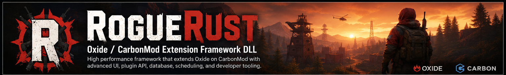

<p align="center">
  
</p>

# RogueRust — Oxide / CarbonMod Extension Framework DLL

**Current testing line: RogueRust 3.3.1**

RogueRust is an Oxide-first, Carbon-compatible server-side framework DLL for Rust plugins. It centralises reusable UI, image/FileStorage, database, HTTP, scheduling, world, teleport, administration-state, resilience, profiling, security and developer services so compatible plugins do not each run competing infrastructure.

> **Channel safety:** testing builds are published as `v3.3.1-testing` prereleases and use `update-manifest-testing.json`. Stable installations continue to use the stable `update-manifest.json` channel.

## Changelog at a glance

### 3.3.1-testing — current
- Advances backend, assembly, runtime and plugin-manifest identity to 3.3.1.
- Expands RogueUI administration tokens for overlay, navigation, inputs, dividers, status rails, cards, search, pagination and compact controls.
- Standardizes a centered 960×640 dark F1/TeleportGUI-inspired administration workspace with restrained lime selection/accent states.
- Adds bounded UI scaling and retains semantic Regular/Medium/Bold/Mono/Brand/Icon font roles.
- Continues shared teleport execution/safe-destination/back-state through `IRogueTeleportService`.
- Continues lightweight shared vanish state through `IRogueVanishService`, designed for event-driven AdminVanishUncharted/AdminMenu policy rather than global per-frame polling.
- Continues ImageLibrary-v2 development toward bounded workers, priority requests, normalized-URL in-flight deduplication/fanout, retry/backoff, negative caching/cooldowns and richer queue/latency telemetry.
- Targets RogueRustAdminMenu 1.3.x page/UI, teleport, vanish and Give/ImageLibrary testing.

### 3.3.0-testing
- Began the coordinated administration-platform overhaul.
- Added shared vanish-state service/bootstrap and administration capability discovery.
- Added shared RogueUI design/font primitives for a consistent F1-style plugin family.
- Continued moving AdminMenu teleport workflows onto the shared RogueRust teleport service.

### 3.2.x
- Added shared safe teleport destination resolution, teleport result reporting, previous-location tracking and Back support.
- Hardened protected CI and isolated testing releases from the stable updater pointer.

### 3.1.x
- Expanded plugin manifests, capability/dependency contracts, service discovery, world helpers, stability reporting and SDK/API validation.

### 3.0.0
- Consolidated the mature 2.x platform into the stable public 3.x framework contract.

## Main framework areas

| Area | What RogueRust provides |
| --- | --- |
| **RogueUI** | CUI documents, callbacks, layouts, templates, pagination, modals, state, partial/unchanged-render handling, pressure metrics and shared 3.3 administration design tokens. |
| **ImageLibrary** | URL/FileStorage cache, content dedupe, reverse index, owner namespaces, pressure telemetry, native item icons and optional Workshop preview resolution. |
| **Administration** | Shared safe teleport/back state, shared vanish state and reusable AdminMenu-facing UI primitives. |
| **World** | Players/entities, terrain, topology, grids, monuments, roads/rivers/rail, spatial queries and spawn/safe-position helpers. |
| **Database** | SQLite plus optional MySQL/MariaDB-compatible providers, migrations, transactions, batching and bounded concurrency. |
| **HTTP/networking** | JSON, retries, bounded responses, global/per-host concurrency, attribution and circuit breakers. |
| **Scheduler/workloads** | Delay/repeat/cron, ownership, cancellation, retries, debounce, throttle, coalescing and unique-repeat helpers. |
| **Runtime/observability** | Logging, profiling, recent metrics, owner pressure, soak/stability monitoring, pooling, cache and lifecycle ownership. |
| **Developer SDK** | Plugin manifests, dependency validation, capability contracts, adapters, compatibility reporting, API baseline and service discovery. |
| **Security/integrations** | Secure callbacks, integrity helpers, permission helpers, Discord webhooks/components and typed integrations. |

## RogueRustAdminMenu 1.3.x integration

RogueRust 3.3.x is being developed alongside the AdminMenu 1.3.x overhaul. The target UI is a compact centered F1-style workspace covering Dashboard, Players, Teleport, Permissions, Groups, Convars, Plugins and Give pages using shared RogueUI design primitives rather than unrelated per-page themes.

The DLL owns reusable bounded state/work: safe destination resolution, teleport execution/back state, shared vanish state and common UI/image infrastructure. The plugin remains responsible for permissions and Rust-specific gameplay policy.

AdminVanishUncharted integration is designed around event hooks for visibility and NPC targeting, with optional plugin policy such as god mode, flight/noclip, HUD state and metabolism/radiation cleanup. This avoids introducing a server-wide administration polling loop.

## ImageLibrary and Steam

A player SteamID and Steam Web API key are **not required** by RogueRust's core image pipeline. Normal images are resolved from URLs and stored through Rust FileStorage. Native Rust item/skin rendering remains the preferred low-cost path where suitable; Workshop preview resolution is optional.

The 3.3.1 ImageLibrary-v2 direction focuses on bounded concurrency and memory pressure: request deduplication/fanout, priority-aware work, retry/cooldown state and owner/queue/latency telemetry while keeping Unity texture work on the safe thread.

## Installation

Install `Oxide.Ext.RogueRust.dll` in the normal Oxide extension location used by your server and restart the server after replacing it. Carbon is supported through its Oxide-compatible runtime surface; RogueRust does not require a hard Carbon compile-time dependency.

For development/testing use the `v3.3.1-testing` prerelease. Production servers should remain on the stable release/update channel until the testing line is promoted.

## Diagnostics

Useful validation commands include:

```text
roguerust.version
roguerust.status
roguerust.health
roguerust.compatibility
roguerust.capabilities
roguerust.performance
roguerust.recent
roguerust.pressure
roguerust.resilience
roguerust.soak
roguerust.world
roguerust.jobs
roguerust.network
roguerust.database
roguerust.services
roguerust.sdk
roguerust.security
roguerust.update
```

For 3.3.1 testing, exercise AdminMenu navigation, teleport destinations and Back behavior, vanish transitions/unload cleanup, Give/ImageLibrary previews and extension shutdown/restart. Include the relevant diagnostics output when reporting runtime or performance issues.

## Performance model

RogueRust intentionally favors bounded/shared work over uncontrolled background activity: global/per-host HTTP limits, serialized SQLite, opt-in bounded remote DB concurrency, bounded queues/state, controlled Unity image processing, striped persistence locks, monotonic cooldown timing, unchanged-UI suppression, circuit breakers, bounded telemetry and event-driven administration state.

## Release contents and compatibility

Protected releases provide `Oxide.Ext.RogueRust.dll` plus generated release/package metadata, checksums and documentation/samples where applicable. Testing releases are prereleases and only update the testing manifest pointer.

The 3.3.1 line remains additive to the 3.x public contract wherever practical. Public API/capability validation is used to catch accidental removals before release; intentional breaking changes should be explicitly documented rather than introduced through incidental refactoring.
